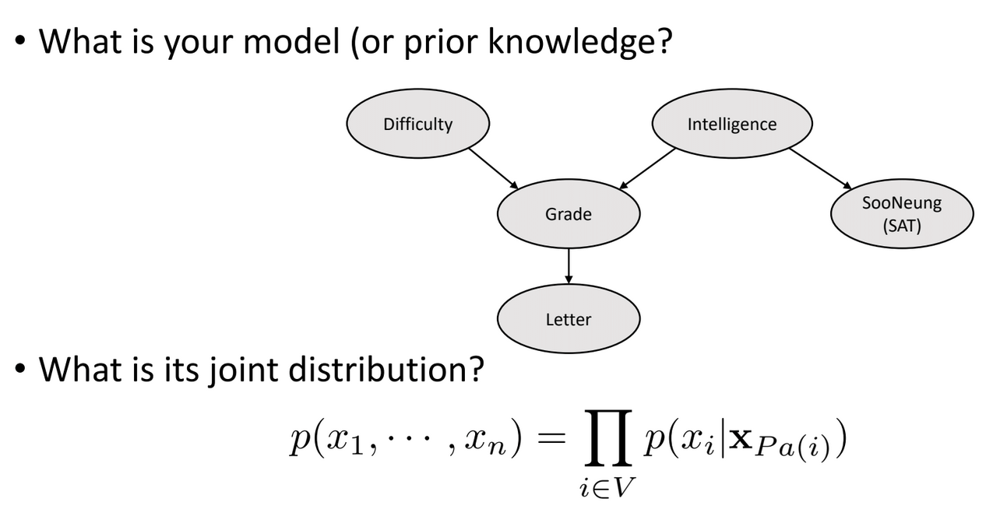
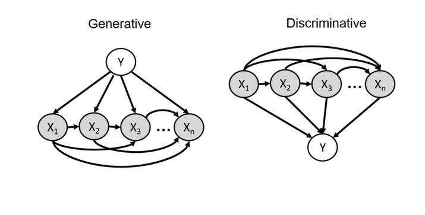
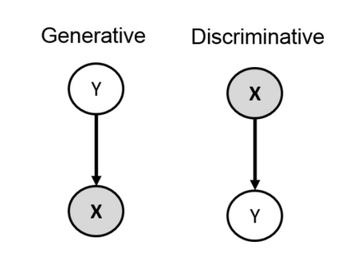

# Autoregressive Model (1) 
## 🔥 Autoregressive Model 이란?
Autoregressive Model 란 현재 출력이 과거의 출력값들에 조건부로 의존하는 확률 생성 모델이다:
$$
P(\mathbf{x}_{1:D})=P(x_0)\Pi_{i=1:D} P(x_i|\mathbf{x}_{1:i}).
$$

$P(x_i|\mathbf{x}_{1:i})$를 모델링하기 어렵지만, $\mathbf{x}$ 내부의 원소들간에 인과관계가 있는 경우(e.g., Audio) 이러한 모델링이 장점을 가진다. 다른 생성형 모델(such as, flow-based, implicit models...) 에 비해서 학습이 Stable하고, Sampling은 느리다(순서대로 봐야 함으로 O(n) 만큼의 시간 복잡도를 가짐).

## 🤔 확률 생성 모델이란?
$P(\mathbf{x})$를 생성한다는데 이게 무슨 말인지 직관적으로 안와닿을 수 있다. 쉽게 설명하면, 상황은 이렇다: 예를 들어 내가 이미지를 보았는데 강아지 사진이 나왔다고 가정해보자! 그때 어떠한 분포에서 강아지 사진이 나왔을까? 
\
즉, 현재 상황은 "$\textit{Sampling 은 할 수 있지만, 정확히 어떤 분포인지를 모르는 상황}$" 이다. 난 처음에 이 문제 자체가 뭔가 신기?하다고 느꼈다. 그런데 생각해보면, 강아지가 어떠한 분포에서 추출했는지 알 방법이 없다. 그래서 이걸 왜 알아야 하냐? $P(\mathbf{x})$를 알아서 좋은게 뭐냐? 라고 생각이 들었는데, 그거에 대한 답변은 나중에 차근차근 하겠다.
\
그러니까 내 생각에는, 확률 생성 모델이란, $\textit{샘플링}(i.e., \mathbf{x} \sim P(\mathbf{x}))$ 은 할 수 있는데, $P(\mathbf{x})$를 모르는 상황에서, $P(\mathbf{x})$ 를 추정하여, 어떤 확률을 생성해내는, 정확히 이야기하면 확률 분포를 찾고자 하는 문제같다. 처음 들었을 때 굉장히, 매력적인 문제였다.

### 🪙 Coin Example 
동전을 던졌을 때, 앞 혹은 뒤가 나온다. $P(\mathbf{x})$ 가 뭘까? 여기서 $\mathbf{x}=\{앞,뒤\}$ 이다.
\
이때 우리는 앞 아니면 뒤기 때문에 $P(\mathbf{x}=앞)=\beta$ 라면, $P(\mathbf{x}=뒤)=1-\beta$ 라고 할 수 있다.
\
그러면 $P(\mathbf{x})$는 뭘까?

$$
P(\mathbf{x}; \beta) =
\begin{cases}
\beta       & \text{if } \mathbf{x} = 앞 \\
1 - \beta   & \text{if } \mathbf{x} = 뒤.
\end{cases}
$$

이때 이러한 $P(\mathbf{x})$를 사람들은 "베르누이 분포"라고 부르기로 했다. 
\
동전 던지기 문제를 $\beta$라는 변수를 가지고 $P(\mathbf{x})$를 모델링 할 수 있음을 우리는 동의할 수 있다.

### 🎲 Dice Example 
이제는 조금 더 복잡한 문제인, 주사위 문제를 떠올려보자~~
\
주사위를 던졌을 때, 6이 나왔다고 해보자. 샘플링을 했는데, 6이 나왔다는 건데, 이때 $P(\mathbf{x})$는 뭘까? 여기서 $\mathbf{x}=\{1,2,3,4,5,6\}$.
\
1이 나올 확률은 $\beta_1$ ... 5가 나올 확률을 $\beta_5$, 마지막으로 6이 나올 확률은 $1-(\sum_{i=1:5}\beta_{i})$ 이다. 그러므로 총 5개의 변수($\beta_1 \sim \beta_5$) 가 필요해진다.
\
이때 $P(\mathbf{x})$는 다음과 같이 적을 수 있다:
$$
P(\mathbf{x}; \beta_{1:5}) =
\begin{cases}
\beta_1 & \text{if } x = 1 \\
\beta_2 & \text{if } x = 2 \\
\vdots \\
1-(\beta_1 + \beta_2 + \beta_3 + \beta_4 + \beta_5) & \text{if } x = 6
\end{cases}
$$
사람들은 이러한 분포를 "Categorical 분포" 라고 부르기로 약속했다. 
\
눈치가 빠르다면 알겠지만, $\text{가능한 상태의 갯수}-1=\textbf{필요한 변수}$ 이다. 즉 확률 변수와 비례해서 필요한 변수도 커진다!

### 🔷 Pixel Example
예를 들어서, 강아지 사진의 (0,0) 위치에 있는 픽셀을 모델링 한다고 해보자, 몇 개의 변수가 필요 할까?
\
R,G,B 각각 256 (0~255) 의 이산적인 값을 가진다고 가정할 때, 
\
총 가능한 상태는 (R,G,B) 해서 256 * 256 * 256 이고,
\
총 필요한 변수는 256 * 256 * 256 - 1이다.

### 🔷 MNIST Example
32 by 32 숫자 이미지인 MNIST의 $P(\mathbf{x})$ 를 모델링한다고 가정할 때(각 픽셀은 0 또는 1, 흑 or 백), 에서 가능한 상태가 몇 가지 일까? $2^{32\times 32}\approx 10^{308}$ 이다. 
\
관측 가능한 우주에 있는 별의 갯수가 $10^{24}$ 인 것에 비하면, MNIST의 $P(\mathbf{x})$ 를 모델링 하기 위해서 필요한 변수가 "압도적으로" 많다. 
\
그리고 $P(\mathbf{x})$ 를 만들기 위해서 필요한 변수의 갯수는 $10^{308}-1$ 이다. 이거를 optimal 하게 구한다는게 양자 컴퓨터에서 가능할랑가? (난 모름)

### 🔷 Independence!

음...간단한 MNIST 문제에서도, $P(\mathbf{x})$를 모델링하기 위해 필요한 변수가 너무 많아 보인다.
\
그렇다면, 이제 각 확률 변수가 독립적이라고 가정하고, MNIST에서 가능한 "상태"에 대해서 생각해보자.
\
독립적이라는 가정을 할 때, 상태의 갯수는 어떻게 될까?
\
각각이 독립적이여도 (직관적으로 이야기해서, 하나의 픽셀이 다른 픽셀의 샘플링에 영향을 주지 않는다고 할 지라도)
\
상태의 갯수는 그대로 $2^{32\times 32}\approx 10^{308}$ 이다. 
\
하지만 필요한 변수의 갯수는 확 줄일 수 있다!

### 🔥🔥🔥🔥Powerfulllllll Independent🔥🔥🔥🔥
뭘 줄일 수 있다는 거임? 
\
처음에는 나도 뭐 어쩌라는거지 라고 불만 가득했다, 이해가 어려워서 그랬던 것 같다.
\
그래서 좀 쉽게 풀어서 설명해보자면, $P(x_1,x_2)$ 를 모델링 한다고 가정해보자(각각 1 또는 0).
\
독립이 없다는 가정에서는
$$
P(x_1=0,x_2=0)=\beta_1,\\
P(x_1=1,x_2=0)=\beta_2,\\
P(x_1=0,x_2=1)=\beta_3,\\
P(x_1=1,x_2=1)=\beta_4 .
$$
확률 분포 $P(x_1,x_2)$를 모델링 하기 위해서 총 4개의 상태가 존재하고 4개의 변수가 필요하다.
\
하지만 각 내부의 확률 변수들이 독립적이라고 가정하면,
$$
P(x_1=0,x_2=0)=P(x_1=0)~P(x_2=0),\\
P(x_1=0,x_2=0)=P(x_1=1)~P(x_2=0),\\
P(x_1=0,x_2=1)=P(x_1=0)~~P(x_2=1),\\
P(x_1=1,x_2=1)=P(x_1=1)~P(x_2=1) .
$$
이므로, $P(x_1=0)=\beta_1$ 와 $P(x_2=0)=\beta_2$ 만 있으면 된다.
\
왜냐하면 자동으로 $P(x_1=1)=1-\beta_1$ 와 $P(x_2=1)=1-\beta_2$ 가 되고,

$$
P(x_1=0,x_2=0)=P(x_1=0)~P(x_2=0)=(\beta_1)(\beta_2),\\
P(x_1=0,x_2=0)=P(x_1=1)~P(x_2=0)=(1-\beta_1)(\beta_2),\\
P(x_1=0,x_2=1)=P(x_1=0)~~P(x_2=1)=(\beta_1)(1-\beta_2),\\
P(x_1=1,x_2=1)=P(x_1=1)~P(x_2=1)=(1-\beta_1)(1-\beta_2) .
$$
처럼 $P(x_1,x_2)$ 가 모델링 가능하다.

정리하면 다음과 같다:
1. Not Indepedet: $\text{가능한 총 상태의 갯수}-1=\textbf{필요한 변수}$
2. Independent: $\text{상태 변수의 갯수}=\textbf{필요한 변수}$

말도 안되게 필요한 변수의 갯수가 줄어든다. 나만의 직관적인 해석을 하자면, 독립적이지 않다는 것은 내부의 변수들이 서로 "상관"이 있다는 것이다. 상관이 있다는 것은 어떤 하나가 다른 하나의 영향을 준다는? 것 같고, 이는 확률 분포의 모델링을 굉장히 까다롭게 만든다. 반면에 독립적이라는 상황은 변수간에 아무 상관이 없기 떄문에, 어떠한 확률 모델링을 훨씬 간단하게 해주는 장점이 있다.

하지만 내부 변수들끼리 너무 Independence 하다는 것은 too strong 한 가정이다!(e.g., 어떤 한 픽셀이 엄청 밝으면 나머지도 밝을 가능성이 있다)

### 🔷 Conditional Independence

그렇다면, 조건적으로 독립을 이용하는 방법은 어떨까? 
\
예를 들어 이웃한 픽셀 간에만 상관이 있다거나(독립이 아니라거나), 이웃한 10개만 독립이 아니라거나...등등
\
일단 간단하게 조건부 독립에 대해서 집고 넘어가자.
$$
P(\mathbf{x},\mathbf{y}|\mathbf{z})=P(\mathbf{x}|\mathbf{z})~P(\mathbf{y}|\mathbf{z})~\Longleftrightarrow~\mathbf{x} \perp \mathbf{y}  \quad \text{given}~\mathbf{z}
$$
직관적으로, $\mathbf{z}$를 알면, $\mathbf{x}$ 와 $\mathbf{y}$ 가 정보적으로 분리된다는 의미이다.
\
High Demensional한 구조를 Local 한 구조로 분해할 수 있음을 의미!

### 🔷 Chain Rule을 이용한 분해

그래서 이거를 어떻게 활용해야할까? 정답은 체인룰에 있다...
\
정말 근데 체인룰은 고등학교부터 현재 시점인 석사 2년차까지 끊임없이 나오는 가장 중요한 이론인 것 같다.
\
물론 현대 사람들은 당연하다고 생각하고 쓰겠지만, 나는 이거를 이렇게 까지 편하게 사용할 수 있도록 해준 천재적인 수학자들이 대단한 것 같다 (세상에는 당연한거는 없다고 생각함).
\
쨋든 분해를 해보면:
$$
P(\mathbf{x})=P(x_1)P(x_2|x_1)...P(x_n|x_{1:n}).
$$
이 체인룰 자체는 상태의 갯수와 확률을 모델링하기 위해 필요한 파라미터의 갯수 자체에 변화를 주지는 못한다.
\
이제 Markov 구조(1차 조건부 독립)를 도입해보자.
\
Markov Assumption이란:
$$
\mathbf{x}_{i+1} \perp \mathbf{x}_{1:i-1} | \mathbf{x}_{i}.
$$
이전 상태를 정확히 안다면, 내가 어떤 과거에 상태를 가졌건간에 상관이 없다는 것이다. Bayes Filter를 유도할 때 사용된다.
예를 들어, 내 로봇의 현재 속도는 이전 속도만 알면 어느정도 알 수 있다. 굳이 100초전 속도를 알 필요는 없다.
\
이를 이용하여 다음과 같은 식을 유도할 수 있다:
$$
P(\mathbf{x})=P(x_1)P(x_2|x_1)...P(x_n|x_{1:n})=P(x_1)\Pi_{i=2:n}P(x_i|x_{i-1}).
$$
결과 필요한 파라미터의 수는 $P(x_1)$ 1개, $P(x_i|x_{i-1})$ 각각 2개 이므로 $1 + (n-1) * 2 = 2n-1$ 이다.

### ✅정리

MNIST 와 비슷한 각 확률 변수들이 {0,1} 둘 중 하나만 가질 때, 가정에 따른 확률 변수 모델을 위한 파라미터의 갯수에 대해서 표로 나타내어 봤다.

| 가정/기술        | 파라미터 수         | 장점                             | 단점                          |
|------------------|----------------------|----------------------------------|-------------------------------|
| Full Joint       | \(2^n - 1\)           | 완전한 표현 가능                  | 지수적 크기 → 비현실적        |
| 전부 독립        | \(n\)                 | 매우 간단, 파라미터 수 최소화     | 너무 강한 가정, 표현력 부족   |
| 1차 독립 (Markov)| \(2n - 1\)            | 선형적 파라미터 수, 순차 구조 반영 | 구조 제약, 비순차 데이터에 부적합 |
| Chain Rule       | \(2^n - 1\)           | 항상 성립, 일반적인 표현 가능     | 파라미터 수 여전히 지수적     |

가장 좋은거는 아마 1차 독립(Markov) 와 비슷한 N차 독립이라고 생각이 든다!
\
그러면 이러한 N차 독립을 어떻게 표현하면 효율적이고 직관적이고 쉬울까? 정답은 Bayes Network에 있다.

## 🤔 Bayes Network: General Idea

베이즈 네트워크는 이러한 N차 독립을 쉽게 표현하기 위해서 만들어진 그래프 구조이다.
아래 예시를 보는게 빠를 것 같다:

    

과연 $P(난이도, 성적, 성적, 지능, 수능)$ 의 확률 분포는 어떻게 표현할 수 있을까? 그림의 그래프 구조를 참고하면 정말 쉽게 가능하다.
$$
P(난이도, 성적, 등급, 지능, 수능) = P(난이도) * P(지능) * P(성적 | 난이도, 지능) * P(등급 | 성적) * P(수능 | 지능).
$$
그래프 그림을 통해, N차 독립과 관련된 확률 분포를 쉽게 나타낼 수 있다. "Efficient Representation"이 강점이며, Local한 정보를 반영하여 확률 분포를 모델링하는데 큰 도움을 준다!

## 🔷 Bayes Optimal Classifier

그래서 뭐...$P(\mathbf{x})$를 잘 구했다고 치자! 그러면 뭐가 좋은건데? 라고 의문에 대한 대답을 할 차례가 왔다. 그 대답중 한 가지는, 분류 문제를 풀 수 있기 때문이다. 아래는 분류 문제의 목표를 수식화 한 것이다:
$$
f^*(\mathbf{x})=\underbrace{\text{argmax}_{\mathbf{y}} P(\mathbf{y}|\mathbf{x})}_{\text{Discriminative Approach}}=\underbrace{\text{argmax}_{\mathbf{y}} P(\mathbf{x}|\mathbf{y})P(\mathbf{y})}_{\text{Generative Approach}}.
$$
이 문제를 해결하기 위한 방법을 2가지로 나누는데, 첫 번째는 "Generative Model" 그리고 두 번째는 "Discriminative Model" 이다.

### 📸 Generaitve Model

이 방법은 $P(\mathbf{x}|\mathbf{y})$와 $P(\mathbf{y})$ 모델링 하고자 한다. $P(\mathbf{y})$는 그냥 Class 갯수 대로 uniform? 하게 분포하면 되지만, 문제는 어떻게 $P(\mathbf{x}|\mathbf{y})$ 를 모델링 하냐이다.

### 🕵🏻 Discriminative Model

반대로 Discriminative Model은 어떻게 $P(\mathbf{y}|\mathbf{x})$를 모델링하느냐가 문제이다. 보통 여기서는 $\mathbf{x}$가 given 이기 때문에 $P(\mathbf{x})$는 크게 고려하지 않는다.

    

정리하면 위 그림처럼 "Generative Model"은 Given $\mathbf{y}$ 에 대해서 $\mathbf{x}$ 를 추론하는 문제이고, "Discriminative Model"은 Given $\mathbf{x}$ 에 대해서 $\mathbf{y}$ 를 추론하는 문제이다.

$\mathbf{x} = \mathbf{x}_1$, $\mathbf{y} = \{0,1\}$ 라고 할 때,

Generative Approach는 $P(\mathbf{x}|\mathbf{y})$ 를 알고 있어서, 다음과 같이 추론:

$$
P(\mathbf{y}=0|\mathbf{x} = \mathbf{x}_1)=\frac{P(\mathbf{y}=0)P(\mathbf{x} = \mathbf{x}_1|\mathbf{y}=0)}{\int_{y\in \mathbf{y}}~P(\mathbf{y}=y)P(\mathbf{x} = \mathbf{x}_1|\mathbf{y}=y)~dy},
$$

$$
P(\mathbf{y}=1|\mathbf{x} = \mathbf{x}_1)=\frac{P(\mathbf{y}=1)P(\mathbf{x} = \mathbf{x}_1|\mathbf{y}=1)}{\int_{y\in \mathbf{y}}~P(\mathbf{y}=y)P(\mathbf{x} = \mathbf{x}_1|\mathbf{y}=y)~dy}.
$$

Discriminative Model은 알고 있는 것이 $P(\mathbf{y}|\mathbf{x})$ 여서 다음과 같이 추론:
$$
P(\mathbf{y}=0|\mathbf{x}=\mathbf{x}_1),
$$

$$
P(\mathbf{y}=1|\mathbf{x}=\mathbf{x}_1).
$$

    

분류 문제에서 Generative Approach는 약간 Direct한 방식으로 분류를 하는게 아니고, Indirect한 방식으로 $P(\mathbf{x})$ 에 대한 확률을 구한 다음 Bayes Rule에 따라 해당 Class를 예측한다. 반면 Discriminative Approach는 곧 바로 해당 확률에 접근하여 예측한다. 위 그림처럼 수학적으로는 무엇을 동일하지만, 조금은 다른 방식을 서로 가지게 된다. 그렇다면 각각이 가지는 장단점이 뭘까?

간단하게 이야기하자면, 보통 현실에서 문제는 $\mathbf{x}$가 완벽하게 주어지지 않는 경우가 많다(e.g., 특정 부분이 손상된 강아지 사진). 하지만 우리는 $P(\mathbf{x})$에 대해서 알고 있다. 손상된 부분을 $\square$ 그리고 정상인 부분을 $\bigcirc$ 이라고 하자 (i.e.,\ $\mathbf{x}=\{\square, \bigcirc\}$). 아래와 같이 marginalization 할 수 있다:
$$
P(\mathbf{x}=\{\square, \bigcirc\})=\int_{\bigcirc}P(\square|\bigcirc)P(\bigcirc)d\bigcirc.
$$

직관적으로 설명해서 관측되지 않은 부분에 대해서 모든 경우의 수를 고려하여, $P(\mathbf{x})$ 를 예측할 수 있다.

그래....멀리도 왔다...위 예시는 조금 부적절할 수 있으니까, 일단 넘어가주기를 바란다. 하여간 $P(\mathbf{x})$를 구해야 하는 이유는 뒤에 더 설명해야 알 수 있다. 그러면 일단 최근에 연구는 어떤 방식으로 $P(\mathbf{x})$를 구할까? 다음 포스트에서...